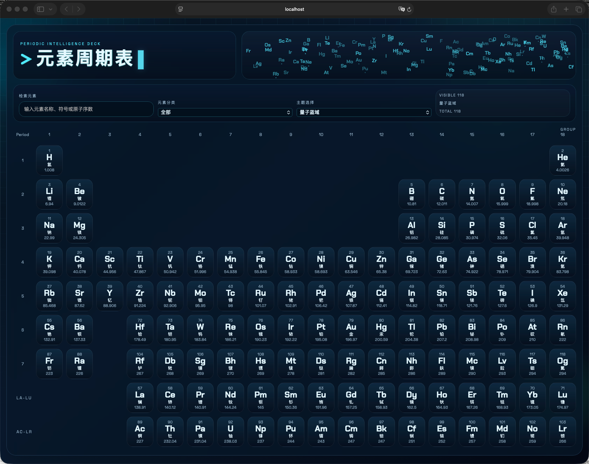
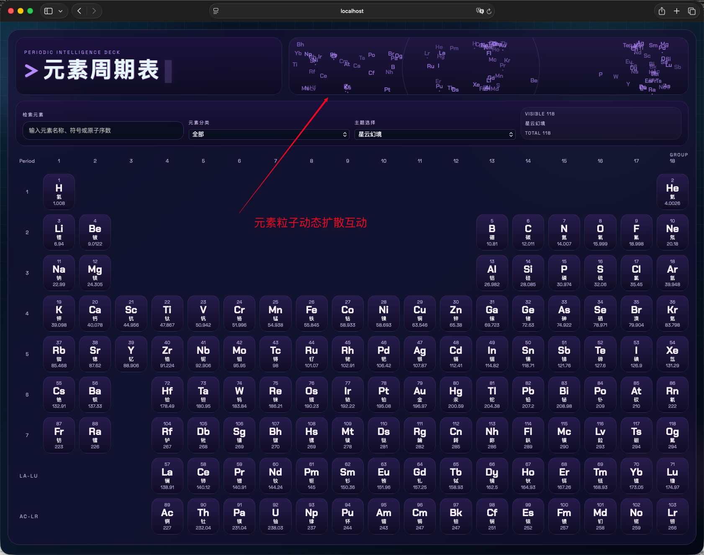
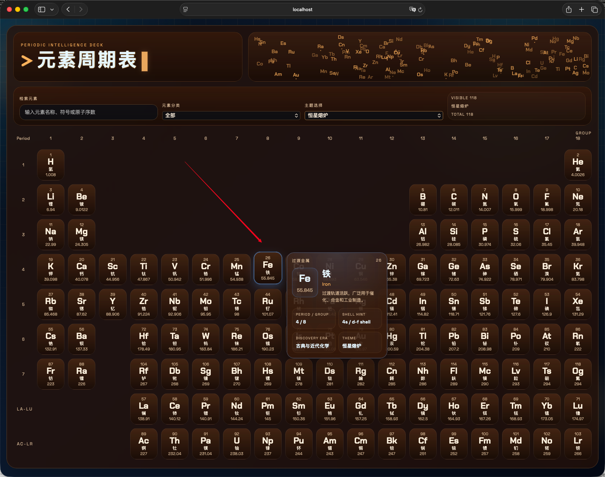
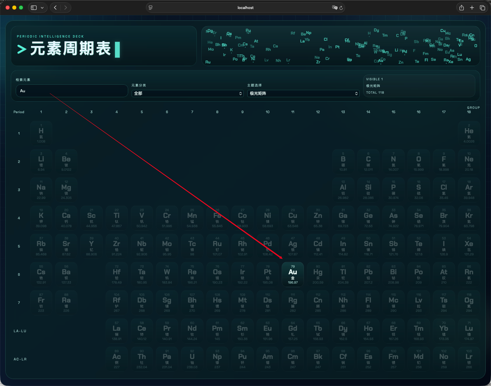
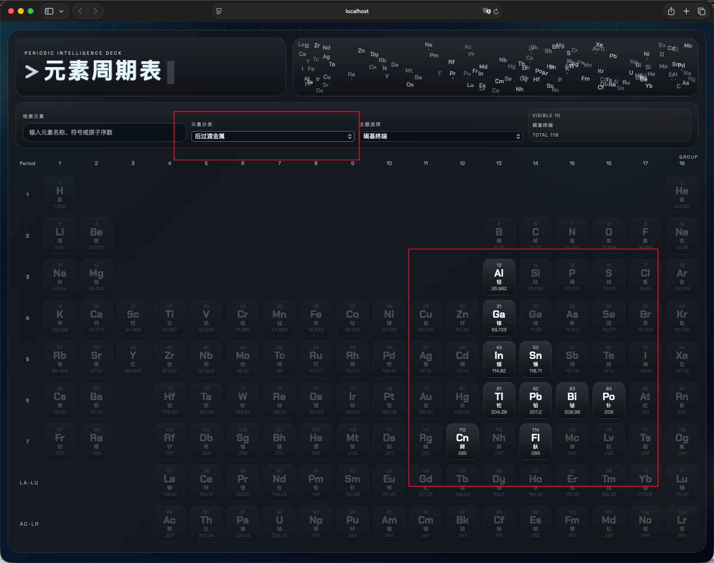

# 元素宇宙：Vue3实现交互式元素周期表


## 📖 项目简介

这是一个基于 **Vue 3 + Vite** 构建的科幻风格元素周期表前端展示项目。项目将传统的化学元素周期表与赛博朋克美学相结合，打造了一个兼具科技感与实用性的交互式学习工具。

### 📌 项目地址

Gitee链接：[https://gitee.com/baifengfeng/periodic-table.git](https://gitee.com/zhengyuxiang/periodic-table)

Github链接：[https://gitee.com/baifengfeng/periodic-table.git](https://github.com/zhengyuxiang/periodic-table)


### ✨ 核心亮点

- **118个元素完整展示**：包含主表、镧系和锕系元素的完整周期表
- **6套主题切换**：量子蓝域、恒星熔炉、极光矩阵、赤焰轨道、星云幻境、碳基终端
- **粒子交互动画**：顶部Canvas粒子区域，支持点击扰动效果
- **智能搜索筛选**：支持按名称、符号、原子序数搜索，按分类过滤
- **悬浮详情卡片**：鼠标悬停显示元素详细信息
- **响应式设计**：适配桌面端和移动端

---

## 🎯 项目作用

### 教育价值
- **化学学习辅助**：直观展示元素周期表的排列规律
- **元素信息查询**：快速检索元素的原子序数、质量、分类等关键信息
- **分类认知强化**：通过颜色编码帮助理解元素分类（碱金属、卤素、稀有气体等）

### 技术演示
- **Vue 3 Composition API**：展示现代Vue开发模式
- **Canvas动画实践**：粒子系统的实现与优化
- **CSS Grid布局**：复杂表格布局的最佳实践
- **响应式设计**：多设备适配方案

### 视觉创新
- **科幻UI设计**：像素终端风格标题、霓虹光效、网格背景
- **动态交互体验**：粒子扰动、悬浮高亮、平滑过渡
- **多主题系统**：CSS变量驱动的换肤机制

---

## 🏗️ 项目架构

### 技术栈

```
核心框架：Vue 3.5.13
构建工具：Vite 6.3.5
样式方案：原生 CSS (CSS Variables)
动画实现：Canvas 2D API
```

### 目录结构

```
PeriodicTable/
├── src/
│   ├── data/
│   │   └── elements.js          # 元素数据定义与处理逻辑
│   ├── App.vue                  # 主应用组件（396行）
│   ├── main.js                  # 应用入口
│   └── styles.css               # 全局样式与主题定义
├── index.html                   # HTML模板
├── package.json                 # 项目依赖配置
├── vite.config.js              # Vite构建配置
└── README.md                    # 项目说明文档
```

### 核心模块解析

#### 1. 数据层 (`src/data/elements.js`)

**数据结构**：
- `rawElements`：118个元素的原始数据数组
- `elementRows`：周期表行列映射关系
- `lanthanides/actinides`：镧系和锕系元素单独处理
- `categoryInfo`：元素分类信息与配色方案

**数据处理流程**：
```javascript
原始数据 → 网格位置计算 → 分类标签注入 → 导出最终元素数组
```

**关键函数**：
- `assignGridPosition()`：计算元素在CSS Grid中的位置
- 镧系/锕系特殊布局处理（第8、9行）

#### 2. 视图层 (`src/App.vue`)

**组件架构**：
```
App.vue (根组件)
├── 头部区域
│   ├── 像素终端标题区
│   └── Canvas粒子交互区
├── 控制栏
│   ├── 搜索框
│   ├── 分类下拉选择器
│   ├── 主题下拉选择器
│   └── 统计信息显示
└── 周期表主体
    ├── CSS Grid布局容器
    ├── 118个元素卡片按钮
    └── 悬浮详情卡片（条件渲染）
```

**核心功能实现**：

**粒子系统**：
```javascript
// 粒子初始化
initializeParticles() → 为每个元素创建粒子对象

// 动画循环
drawParticles() → requestAnimationFrame持续渲染
  ├─ 粒子随机漂移
  ├─ 点击扰动效果
  ├─ 边界碰撞检测
  └─ Canvas绘制
```

**搜索与过滤**：
```javascript
computed filteredElements → 响应式计算属性
  ├─ 关键词匹配（名称/符号/序号）
  └─ 分类过滤
```

**悬浮卡片定位**：
```javascript
updateFloatingCardPosition() → 智能定位算法
  ├─ 计算相对于容器的位置
  ├─ 边界检测与自适应调整
  └─ 避免超出可视区域
```

#### 3. 样式层 (`src/styles.css`)

**主题系统**：
```css
[data-theme="quantum"] { --accent: #6ee7ff; ... }
[data-theme="solar"]   { --accent: #ff9d4b; ... }
[data-theme="aurora"]  { --accent: #00f5d4; ... }
...
```

**视觉效果**：
- CSS Grid实现周期表精确布局
- 自定义属性驱动的主题切换
- 霓虹光效（box-shadow多层叠加）
- 像素风格字体与闪烁光标
- 环境光晕与网格背景

---

## 🚀 启动指南

### 环境要求

- Node.js >= 16.x
- npm >= 8.x

### 安装步骤

#### 第1步：克隆项目

```bash
git clone <repository-url>
cd PeriodicTable
```

#### 第2步：安装依赖

```bash
npm install
```

安装完成后，`node_modules` 目录将包含：
- Vue 3 核心库
- Vite 构建工具
- @vitejs/plugin-vue 插件

#### 第3步：启动开发服务器

```bash
npm run dev
```

启动成功后，终端将显示：
```
VITE v6.3.5  ready in xxx ms

➜  Local:   http://localhost:5173/
➜  Network: use --host to expose
```

#### 第4步：访问应用

在浏览器中打开：
```
http://localhost:5173
```

### 可用命令

```bash
# 开发模式（热更新）
npm run dev

# 生产构建
npm run build

# 预览生产构建
npm run preview
```

### 构建产物

执行 `npm run build` 后，生成的文件位于 `dist/` 目录：

```
dist/
├── assets/
│   ├── index-[hash].css    # 压缩后的样式文件
│   └── index-[hash].js     # 压缩后的脚本文件
└── index.html               # 入口HTML
```

可直接部署到任何静态文件服务器（Nginx、Apache、GitHub Pages等）。

---

## 🎮 交互说明

### 基础操作

| 操作 | 效果 |
|------|------|
| 输入搜索框 | 实时过滤元素（支持中文名、英文名、符号、原子序数） |
| 选择"元素分类" | 仅显示指定分类的元素 |
| 选择"主题选择" | 切换整体视觉主题 |
| 悬停元素卡片 | 显示浮动详情卡片 |
| 点击粒子区域 | 触发粒子扰动扩散效果 |

### 悬浮详情卡片内容

- 元素分类标签
- 原子序数
- 元素符号与原子量
- 中文名称与英文名称
- 分类描述与应用场景
- 周期/族信息
- 电子壳层提示
- 发现时代
- 当前主题名称

---

## 📸 界面展示

### 主界面概览



---

### 主题切换效果

下方功能包含不同主题的效果展示。

---

### 交互细节展示

#### 粒子扰动效果

*点击粒子区域后，粒子从点击位置向外扩散*



---

#### 悬浮详情卡片

*鼠标悬停在元素上时，智能定位的详情卡片*



---

#### 搜索与过滤

*输入"金"或"Au"或"79"均可快速定位金元素*




---

#### 分类筛选

*选择"后过渡金属"后，仅显示该类元素*




---

## 🔧 技术细节

### Canvas粒子系统优化

**性能考虑**：
- 使用 `requestAnimationFrame` 确保流畅动画
- 设备像素比（DPR）适配高清屏幕
- ResizeObserver监听容器尺寸变化
- 组件卸载时清理动画帧和观察者

**物理模拟**：
```javascript
// 速度衰减（摩擦力）
particle.vx *= 0.985
particle.vy *= 0.985

// 点击扰动
force = max(0, (radius - distance) / radius)
particle.vx += (dx / distance) * force * 0.85
```

### CSS Grid布局策略

**主表布局**：
```css
.periodic-board {
  display: grid;
  grid-template-columns: repeat(18, 1fr);
  grid-template-rows: repeat(9, 1fr);
}
```

**元素定位**：
- 主表：7个周期 × 18个族
- 镧系：第8行，从第4列开始
- 锕系：第9行，从第4列开始


---

## 🎨 设计特色

### 视觉语言

- **像素终端风格**：命令行提示符 `>`、闪烁光标、等宽字体
- **霓虹光效**：多层box-shadow模拟发光效果
- **网格背景**：半透明网格线增强科技感
- **环境光晕**：径向渐变营造氛围

### 色彩系统

每个元素分类对应专属色：
- 碱金属：`#ff7b72`（暖红）
- 卤素：`#2de0a7`（青绿）
- 稀有气体：`#f2cc60`（金黄）
- 过渡金属：`#58a6ff`（天蓝）
- ...

---

## 🚦 后续扩展方向

### 功能增强
- [ ] 元素详情弹窗（固定选中模式）
- [ ] 更多属性展示（熔点、沸点、电负性等）
- [ ] 电子排布可视化
- [ ] 元素对比功能
- [ ] 收藏/书签功能

### 交互优化
- [ ] 粒子与主题联动动画
- [ ] 3D旋转周期表
- [ ] 键盘快捷键支持
- [ ] 语音播报元素信息

### 数据可视化
- [ ] 元素分类统计图表
- [ ] 原子量分布热力图
- [ ] 发现时间轴
- [ ] 应用场景词云

---

## 📄 许可证

本项目仅供学习与交流使用。

